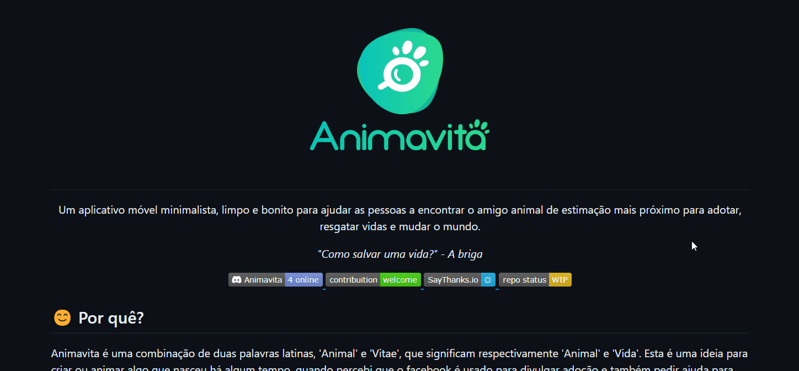

# Projeto com README
Um projeto de teste com arquivo README 🔥

[](https://google.com)

## Tecnologias utilizadas
- HTML
- CSS
- JS

## Como utilizar

Clone o projeto
````
Git clone <url>
````
Acesse a pasta do projeto
````
cd repositorio-com-readme


